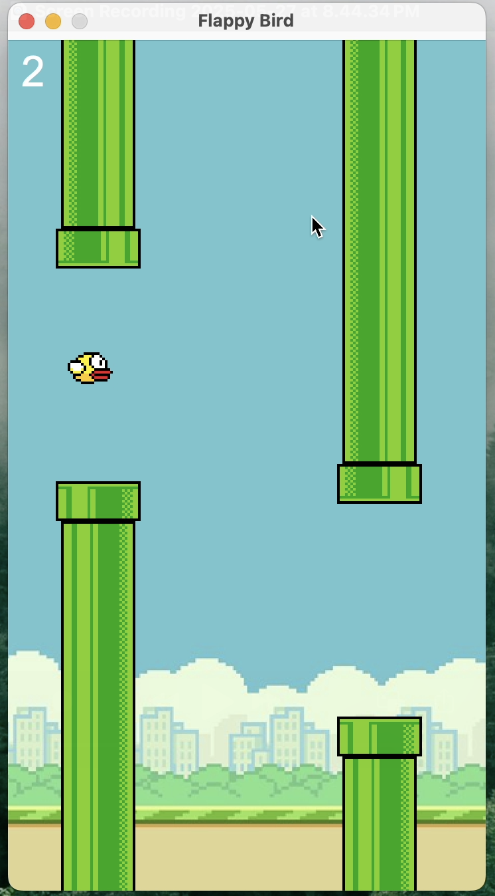

# flappy-bird


A simple java implementation of the classic **Flappy Bird** game using java and swing



---

## main technologies used
- [Java Swing](https://docs.oracle.com/javase/8/docs/api/javax/swing/package-summary.html) (GUI Framework)
- [Java AWT](https://docs.oracle.com/javase/8/docs/api/java/awt/package-summary.html) (Graphics & Event Handling)

---

## how to play
- Press `UP ARROW` or `SPACE` to make the bird jump
- Avoid the pipes
- Score increases by `0.5` each time you pass a pipe
- After a game over, press `SPACE` to restart

---

## 🎯 Controls
- `UP ARROW`: Jump
- `SPACE`: Jump / Restart

---

## setup & running the game

#### clone the repo
```bash
git clone https://github.com/gautam-an/flappy-bird.git
cd flappy-bird

#### compile and run
```bash
javac -d bin src/*.java
java -cp bin App

